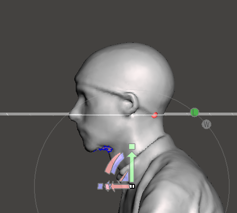
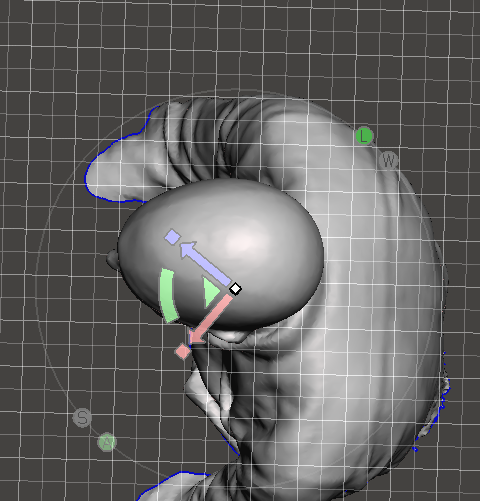
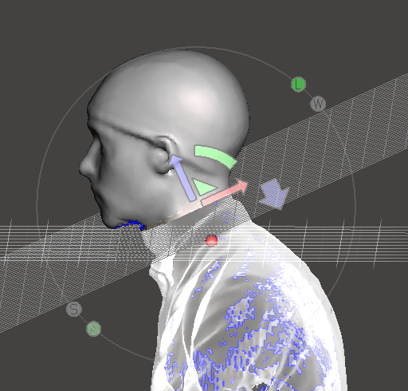
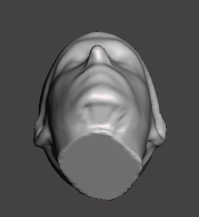
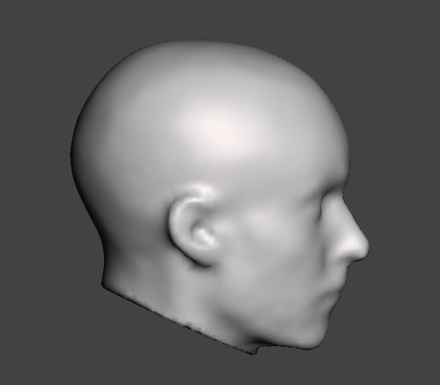
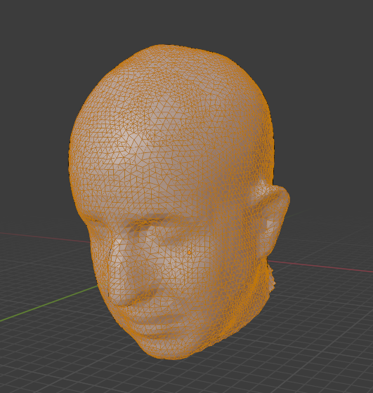

# Processing the 3D Mesh

There are various programs to do this including Meshmixer, Blender, Meshlab or even good old MATLAB. Here I'll focus on Meshmixer:

### 1. Load .ply mesh into Meshmixer

### 2. Transform

Edit --> Transform

Rotate head so it is perpendicular to one axis, and move the mesh up/down so axis plane goes through the nose, cutting the head in two.

### 3. Plane Cut

Edit --> Plane Cut

Cut off the body (!) to leave just the neck and head. Often best to rotate the cutting tool using the green slider. Be careful to cut out any clothes or jewellery around the neck.

### 4. Make Solid

Edit --> Make Solid

Keep default options. This should close any holes you have in the mesh, for example under the chin.

After this click on Analysis --> Inspector to see if all holes have been filled

### 5. Sculpt (optional)

Sculpt --> Shrink Smooth (Strength:43; Size: 39; Depth: 0; Lazyness: 0)

Sculpting will alter the physical shape of the mesh, so use with **CAUTION!** The aim is to smooth and crop bits of the mesh which do not correspond to the physical shape of the scalp. This includes bunches of hair, folds of the swimming cap or other defects you can see. 

See here how the scalp is smooth and the folds of the swimming cap have been removed.

### 6. Scaling (optional)

Edit --> Transform --> Scale X/Y/Z to 0.99

** WARNING: Still testing whether it is right to apply scaling or not - use with caution **

### 7. Export as .ply

File --> Export

### Some things to solve/consider:

- Lower quality meshes might have larger holes which this pipeline will struggle to cope with
... this tool looks interesting...http://www2.imm.dtu.dk/image/MRFSurface/index.html
- Some meshes might have internal faces/vertcies, which isn't great for coreg. Need a way to remove these quickly.. perhaps using Blender?

# Lurking Internal Meshes

Sometimes there might be some meshes 'inside' the scalp, lurking after exporting from Skanect Pro. These can create problems later on in the pipeline, especially when matching/estimating with MRIs.

To solve this, I use Blender (not sure how you'd do it in Meshmixer, but there must be a way!)

### **Steps:**

- Load Blender
- Delete Cube
- Load .ply
- Edit Mode --> Face Select
- **Circle Select (C)** to select all external faces. Make sure you get **ALL** the faces and rotate the mesh to different angles

- Select --> Invert
- Mesh --> Delete --> Faces
- Export .ply

